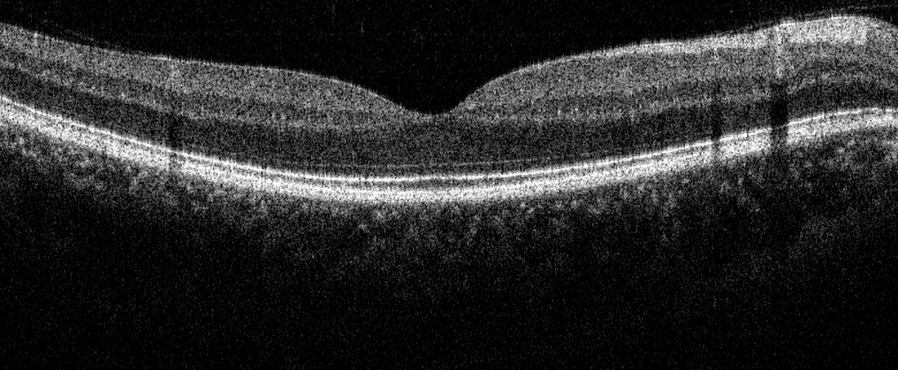

# OCT Denoiser

[](https://github.com/tangericm/OCT-Denoiser/actions/workflows/ci.yml)
[](https://github.com/tangericm/OCT-Denoiser/releases/latest)
[](LICENSE)
[](pyproject.toml)

Self-supervised denoising for already-processed optical coherence tomography
(OCT) B-scans. Give the command-line tool a grayscale TIFF/NPY stack or a folder
of B-scans and a trained checkpoint; it returns a denoised TIFF stack with the
same frame order and spatial dimensions.

The production model is [NAFNet](https://arxiv.org/abs/2204.04676), trained from
adjacent B-scan pairs without clean images as training targets.

<table>
  <tr>
    <td align="center"></td>
    <td align="center"></td>
  </tr>
  <tr>
    <td align="center"><strong>Processed single frame</strong></td>
    <td align="center"><strong>NAFNet prediction</strong></td>
  </tr>
</table>

Both images use one display window derived from the input and applied unchanged
to the prediction. The example is held out of training. See the
[interactive wipe comparison and project overview](https://ericmtang.com/projects/denoiser).

## Results

### Production models

The production evaluation uses five registered 64-frame averages as near-clean
references. Results are three-seed means from the same evaluation protocol.

| Input / model | PSNR | Gain vs. noisy | SSIM | Parameters |
|---|---:|---:|---:|---:|
| Noisy single frame | 12.059 dB | — | 0.1205 | — |
| NAFNet Base-32 | 29.333 ± 0.010 dB | +17.274 dB | 0.7252 | 6.82M |
| **NAFNet Base-64** | **29.518 ± 0.035 dB** | **+17.459 dB** | **0.7323** | 27.11M |

Base-64 is the quality-oriented release. Base-32 provides the same workflow at
roughly one quarter of the parameters. Base-64 network-only latency is 77.0 ms
per native 660×1024 tissue frame (13 fps) on the evaluation GPU.

### Architecture selection

The restoration backbones below were compared at Base-32 on a separate
evaluation corpus, again against registered averaged references over three
seeds. These absolute scores should not be mixed with the production table;
their purpose is the like-for-like model comparison.

| Architecture | PSNR | Gain vs. noisy | SSIM | Parameters | 512×512 latency |
|---|---:|---:|---:|---:|---:|
| Noisy single frame | 9.821 dB | — | 0.0699 | — | — |
| **NAFNet** | **25.490 ± 0.200 dB** | **+15.669 dB** | **0.5379** | 6.82M | 8.6 ms |
| Restormer | 25.313 ± 0.037 dB | +15.492 dB | 0.5324 | 6.53M | 46.9 ms |
| Anisotropic ResUNet | 25.105 ± 0.046 dB | +15.284 dB | 0.5320 | 9.92M | 10.8 ms |
| FFC ResUNet | 25.058 ± 0.114 dB | +15.237 dB | 0.5159 | 1.69M | 5.4 ms |
| ResUNet | 24.868 ± 0.243 dB | +15.047 dB | 0.5193 | 7.23M | 10.3 ms |
| Deformable fusion | 22.509 ± 0.317 dB | +12.688 dB | 0.4958 | 1.09M | 30.0 ms |

Deformable fusion consumes five frames rather than one, so that row is not
strictly like-for-like. NAFNet and Restormer were close in quality; NAFNet was
selected for substantially lower latency.

## Released checkpoints

The first production release provides the seed-0 checkpoint for each model
size. The aggregate results above include all three seeds.

| Checkpoint | Intended use |
|---|---|
| [NAFNet Base-32](https://github.com/tangericm/OCT-Denoiser/releases/latest/download/oct-denoiser-nafnet-base32.pt) | Smaller, faster deployment |
| [NAFNet Base-64](https://github.com/tangericm/OCT-Denoiser/releases/latest/download/oct-denoiser-nafnet-base64.pt) | Highest validated image quality |

## Installation

Python 3.10 or newer and PyTorch 2.4 or newer are required. Install the PyTorch
build appropriate for your operating system and accelerator from the
[official selector](https://pytorch.org/get-started/locally/), then install the
package:

```bash
git clone https://github.com/tangericm/OCT-Denoiser.git
cd OCT-Denoiser
python -m pip install .
```

CUDA is recommended, but inference and tests also run on CPU.

## Denoise B-scans

Download either released checkpoint, then run:

```bash
oct-predict \
  --input path/to/bscans.tiff \
  --checkpoint oct-denoiser-nafnet-base64.pt \
  --output path/to/bscans_denoised.tiff
```

`--input` accepts:

- one 2D grayscale `.tif`/`.tiff` B-scan;
- one multipage grayscale TIFF or 3D `.npy` stack shaped `[frames, height, width]`;
- a folder containing naturally ordered 2D TIFF/NPY B-scans.

By default the output preserves the input integer dtype. Use `--dtype float32`
for floating-point output or `--dtype uint16` for explicit 16-bit output. Input
frames are normalized independently for the network and restored to their
original intensity scale afterward.

This package starts at the processed B-scan. Raw detector reconstruction,
instrument calibration, and acquisition caching are intentionally outside the
public runtime.

## Train on processed B-scans

Training is frame-pair self-supervision: ordered neighboring frames provide two
noisy observations with shared anatomy. Supply at least two volumes or enough
frames to create separate contiguous training and validation groups:

```bash
oct-train \
  --input data/volume_01.tiff data/volume_02/ \
  --base 64 \
  --pair-offset 1 \
  --group-size 64 \
  --epochs 100
```

Use `--pair-offset 2` when repeat geometry places the corresponding view two
frames away. Groups are split before pairs are constructed, preventing adjacent
frames from crossing the training/validation boundary.

Each run contains:

```text
runs/<experiment>/<timestamp>/
├── checkpoints/
│   ├── best.pt
│   └── final.pt
├── config.json
└── history.json
```

## Project structure

```text
src/octdenoiser/
├── cli/          oct-predict and oct-train
├── configs/      processed B-scan training configuration
├── data/         TIFF/NPY discovery, pairing, splitting, and loading
├── engine/       training, validation, inference, and losses
├── networks/     production NAFNet architecture
└── utils/        reproducibility and run-directory helpers

tests/            synthetic processed-B-scan tests
docs/assets/      public before/after result images
```

## Development

Install the development dependencies and run the same checks as CI:

```bash
python -m pip install -e ".[dev]"
ruff check .
mypy
python -m compileall -q src tests
python -m pytest
```

This is research software and is not intended for clinical diagnosis or
treatment.

## License

Released under the [MIT License](LICENSE).
