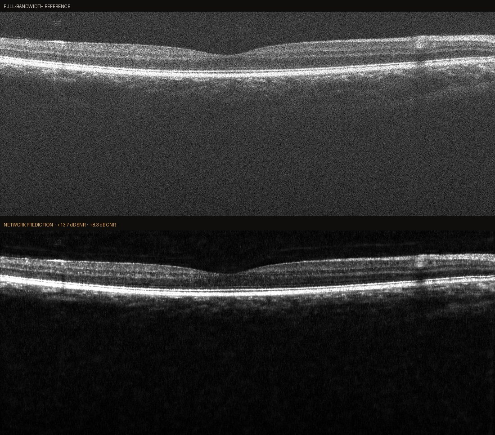

# OCT Denoiser

[](https://github.com/tangericm/OCT-Denoiser/actions/workflows/ci.yml)
[](LICENSE)
[](pyproject.toml)

Deep learning pipeline for denoising OCT B-scans using a ResUNet with pseudo-3D spectral stem. Raw `.raw` spectral data is preprocessed on-the-fly (k-linearisation → spectral windowing → IFFT → log compress → z-score) and fed to the network as dual-channel (or multi-level sub-window) inputs.

**Author:** Eric Tang (tangericm) · eric.tang22@gmail.com

---

## Results



Self-supervised throughout: no clean reference and no repeat acquisition. Supervision
comes from splitting the raw interferogram into two Gaussian sub-bands separated by a
tunable gap, which yields two reconstructions with identical structure but decorrelated
speckle.

A single model trained across four acquisitions, evaluated against the full-bandwidth
reference on each:

| Acquisition | ΔSNR | ΔCNR |
|---|---|---|
| Macula, 6 mm, 1024 A-lines | +9.45 dB | +4.72 dB |
| Macula centre | +9.95 dB | +5.37 dB |
| Optic disc | +13.82 dB | +5.72 dB |
| Line, 6 mm, 2048 A-lines | +13.71 dB | +8.33 dB |

A run dedicated to a single volume (`window_sigma 0.03`, `gap 0.60`) reaches
**+16.45 dB SNR** and **+12.27 dB CNR** averaged over 64 frames.

> **Numbers pending regeneration.** The table above was produced before two
> metric fixes: ground-truth SNR was computed with `sig_stat="max"` while
> prediction SNR used `"p99.99"`, so ΔSNR was a difference of two different
> estimators — and, since `max ≥ p99.99`, an *understated* one. The axial-FWHM
> estimator also saturated at the search-window edge. Both are fixed; these
> results will be re-run and replaced.

**See [docs/FINDINGS.md](docs/FINDINGS.md)** for the measured study that followed:
supervision schemes compared against near-clean references, detector noise
calibration, the networks-versus-averaging control, and the metric caveats —
including which earlier claims measurement overturned.

Headline results from that study:

- The full-band target **contains** its own input, leaving speckle correlated at
  +0.138 against +0.003 for a clean pairing — the dominant defect in the
  original method.
- Contiguous sub-bands cost **2.43×** the axial PSF width; full-bandwidth frame
  pairing costs none.
- **A single network pass is worth roughly 8–16 averaged frames.**
- PSNR and SSIM reward blur; a residual-structure test catches what they miss.

> Display note: reference and prediction above are rendered through **one shared
> window** with a shared gamma. The black point is anchored to the prediction's 1st
> percentile so its noise floor survives; anchoring to the reference clips 39% of the
> prediction to pure black, which both misrepresents the output and, counter-intuitively,
> *reduces* the visible difference as the two images collapse toward the same black.

---

## Environment Setup

Python ≥3.10 · PyTorch ≥2.4 · CUDA required for practical training

Install the accelerator build of torch first, then the package. `torch` is
deliberately not pinned to a CUDA index in `pyproject.toml`, so CPU-only
environments (including CI) are not forced to download multi-GB wheels.

```bash
conda create --name OCTDenoiser python=3.12
conda activate OCTDenoiser

# GPU (swap cu128 -> cpu for a CPU-only install)
pip install torch torchvision --index-url https://download.pytorch.org/whl/cu128

pip install -e ".[dev]"        # drop [dev] if you don't need the test tooling
```

This installs the `octdenoiser` package and the `oct-*` commands below.

---

## Quick Start

| Command | Does |
|---------|------|
| `oct-train` | training |
| `oct-predict --checkpoint <path>` | inference from a checkpoint |
| `oct-tune` | Optuna window-parameter search |
| `oct-mirror-study` | mirror-phantom baseline study (14 CLI flags) |
| `oct-retina-compare` | qualitative retina comparison |

### 1. Configure your dataset

Edit the `USER CONFIGURATION` section in
[src/octdenoiser/cli/train.py](src/octdenoiser/cli/train.py):

- Set `root_folder` / `data_folder` to point at your `bscan*.raw` files
- Set `pixels` / `alines` to match your OCT system
- Adjust `crop_depth`, `window_sigma`, and `gap` as needed
- Choose `model_name`:
  - `"resunet_pseudo3d"` — standard 2-channel input (no sub-windows)
  - `"resunet_pseudo3d_multilevel"` — multi-level input (requires `n_sub_windows > 0`)

### 2. Train

```bash
oct-train
```

Outputs written to `runs/<experiment_name>/<timestamp>/`:

| Path | Contents |
|------|----------|
| `checkpoints/best.pt` | Best validation checkpoint |
| `predictions_tiff/` | Post-training TIFF stacks |
| `val_outputs/` | Per-epoch validation images + progression TIFF |
| `config.json` | Full run configuration |
| `history.json` | Training / validation metrics history |

### 3. Inference from a checkpoint

Edit the `USER CONFIGURATION` section in
[src/octdenoiser/cli/predict.py](src/octdenoiser/cli/predict.py) so the model and
`FolderSpec` match the checkpoint, then pass the checkpoint path:

```bash
oct-predict --checkpoint runs/OCT-Denoiser/<timestamp>/checkpoints/best.pt
```

`--outdir` defaults to `<run_dir>/predictions`.

> Calibration is **per instrument**. Maestro2 and Maestro3 ship different `.CLB`
> files carrying different k-linearisation LUTs, and applying the wrong one
> resamples onto the wrong k-grid — the reconstruction still looks plausible but
> the depth scale and PSF are wrong, with no error raised. `root_folder` must
> point at the matching instrument directory, or set `FolderSpec.clb_path`
> explicitly.

### 4. Hyperparameter tuning (optional)

Tune `window_sigma` and `gap` with Optuna:

```bash
oct-tune
```

Results are saved as `runs/optuna/<timestamp>/study_results.csv`.

### 5. Sanity checks

```bash
pytest                            # full suite; needs no OCT data
ruff check .                      # lint
mypy                              # types
python -m compileall -q src tests # syntax
```

The suite runs entirely on synthesised raw interferograms and a synthetic `.CLB`
(see [tests/conftest.py](tests/conftest.py)), so it works on a clean checkout
with no instrument data. Fringes are generated against the inverse resampling
LUT, matching the fact that real spectrometers sample linearly in wavelength.

> `compileall` descends into `.git/refs/`, so a branch whose name ends in `.py`
> gets parsed as Python source and fails. Three such branches existed and have
> been pruned; prefer the explicit `src tests` form above so the check cannot
> break again.

---

## Project Structure

```
OCT-Denoiser/
├── pyproject.toml                              # packaging, ruff/mypy/pytest config
├── src/octdenoiser/
│   ├── preprocess.py                           # BscanProcessor: raw -> B-scan tensor
│   ├── cli/
│   │   ├── train.py                            # oct-train
│   │   ├── predict.py                          # oct-predict
│   │   └── tune.py                             # oct-tune
│   ├── configs/default.py                      # TrainConfig, FolderSpec (+ validation)
│   ├── data/
│   │   ├── dataset.py                          # RawBscanDataset (lazy init, LRU cache)
│   │   ├── datamodule.py                       # DataLoader factory
│   │   └── avg_targets.py                      # temporal-average target cache
│   ├── engine/
│   │   ├── train.py                            # AMP training loop, checkpointing
│   │   ├── eval.py                             # patch + full-frame validation
│   │   ├── infer.py                            # raw -> TIFF inference pipeline
│   │   ├── losses.py                           # Charbonnier + gradient L1
│   │   ├── metrics.py                          # SNR/CNR (physical domain)
│   │   └── early_stopping.py                   # patience-based early stopping
│   ├── networks/
│   │   ├── registry.py                         # @register_model decorator
│   │   ├── resunet_pseudo3d.py                 # base ResUNet with Pseudo-3D stem
│   │   ├── resunet_pseudo3d_multilevel.py      # + multi-level spectral input
│   │   ├── dncnn.py                            # DnCNN baseline
│   │   └── unet2d.py                           # plain U-Net baseline
│   ├── experiments/
│   │   ├── run_mirror_study.py                 # oct-mirror-study (14 CLI flags)
│   │   └── run_retina_compare.py               # oct-retina-compare
│   ├── tools/eval_mirror.py                    # PSNR/SSIM/FWHM metric harness
│   └── utils/                                  # seeding, run dirs, TIFF I/O, live plot
└── tests/
    ├── conftest.py                             # synthetic raw + .CLB fixtures
    ├── test_pipeline.py                        # end-to-end preprocessing/dataset
    ├── test_config_validation.py               # config consistency rules
    ├── test_networks.py                        # model forward-pass shapes
    └── test_optimizations.py                   # FFT/resample equivalence
```

---

## Configuration Reference

All configuration is defined in Python dataclasses — no YAML or JSON files.

Two columns below: the **dataclass default** in `configs/default.py`, and the
value **actually shipped** in `src/octdenoiser/cli/train.py`'s `USER CONFIGURATION` block —
which is what produced the results above. They differ; the shipped column is
the one to reproduce.

### `FolderSpec` — per-dataset specification

| Field | Default | Shipped | Description |
|-------|---------|---------|-------------|
| `root_folder` | — | `images\Maestro3` | Root path containing the dataset folder and `.CLB` file |
| `data_folder` | — | `6mm_1024Aline` | Subfolder containing `bscan*.raw` files |
| `pixels` | — | `2048` | Spectral samples per A-line |
| `alines` | — | `1024` | A-lines per B-scan |
| `crop_depth` | `(1024, 2048)` | `(0, 1024)` | `[z0, z1)` pixel crop after IFFT |
| `window_sigma` | `0.08` | `0.05` | Gaussian spectral window width |
| `gap` | `0.15` | `0.60` | Separation between the two window centres |
| `gap_offset` | `0.0` | `0.015` | Shared shift of both window centres |
| `n_sub_windows` | `0` | `2` | Sub-windows per parent; `0` = disabled |
| `sub_window_spread` | `2.0` | `0.5` | Sub-window centre spread in sigma units |

### `TrainConfig` — training hyperparameters

| Field | Default | Shipped | Description |
|-------|---------|---------|-------------|
| `model_name` | `"resunet_pseudo3d"` | `"resunet_pseudo3d_multilevel"` | Model to train |
| `base` | `64` | `32` | Base channel width |
| `epochs` | `300` | `300` | Maximum training epochs |
| `lr` | `3e-4` | `3e-4` | AdamW learning rate |
| `weight_decay` | `5e-5` | `8e-5` | AdamW weight decay |
| `batch_size` | `32` | `12` | Training batch size |
| `patch_mode` | `"patch"` | `"strip"` | `"patch"` = random crop; `"strip"` = full-depth A-line |
| `patch_h` / `patch_w` | `128 / 128` | `288 / 32` | Patch geometry |
| `patches_per_frame` | `16` | `32` | Patches sampled per frame |
| `w_charb` / `w_grad` | `0.8 / 0.5` | `0.0103 / 0.0102` | Charbonnier and gradient loss weights |
| `early_stop_patience` | `5` | `20` | Validation checks without improvement before stopping |
| `snr_sig_stat` | `"max"` | `"p99.99"` | Signal statistic: `"max"` or `"p<N>"` |
| `snr_sig_y0` / `snr_sig_y1` | `111 / 600` | `111 / 600` | SNR/CNR signal ROI rows |

---

## Data Flow

```
Raw .raw (uint16, Fortran order)
  -> DC subtract -> k-linear resample (natural cubic spline, precomputed gttrs)
  -> Gaussian spectral windowing (w1, w2, optional sub-windows)
  -> Batched IFFT -> magnitude -> log10 compress -> z-score normalise
  -> X: [B, 2 + 2*n_sub_windows, H, W]   (float32, normalised)
  -> Y: [B, 1, H, W]                      (full-bandwidth target)
  -> Loss: w_charb * Charbonnier + w_grad * gradient_L1
  -> best.pt checkpoint -> TIFF export
```
